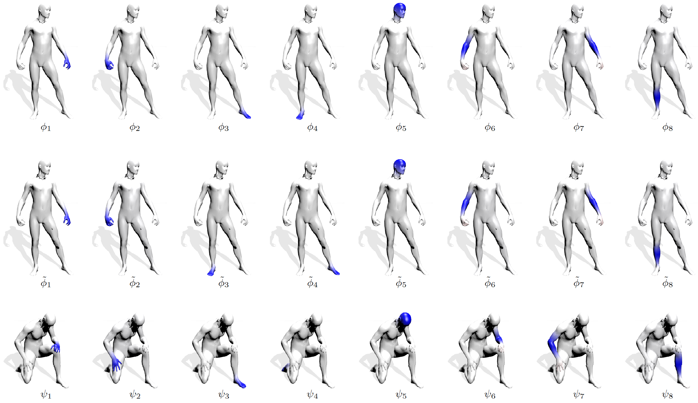
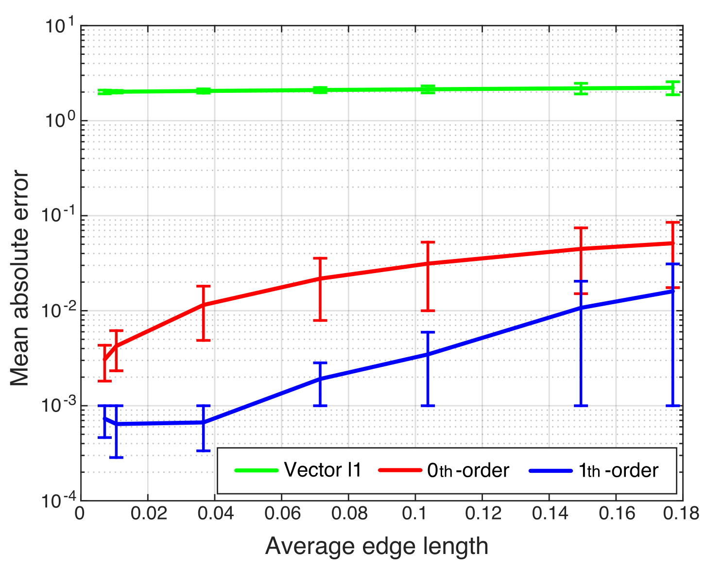
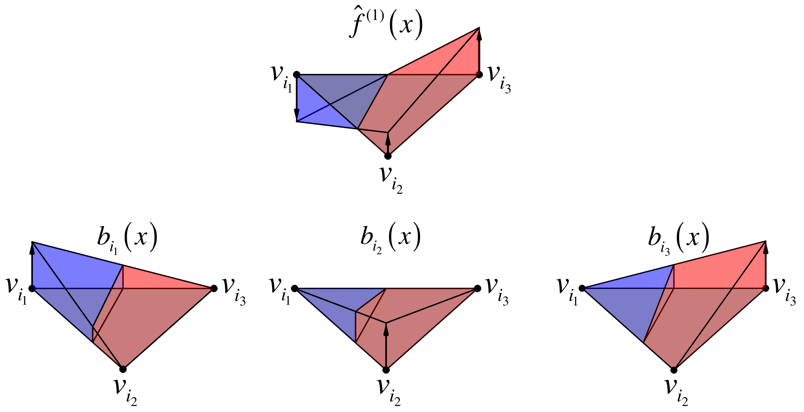

# Consistent Discretization and Minimization of the L1 Norm on Manifolds
[[Arxiv]](https://arxiv.org/pdf/1609.05434)

Evaluation code for Consistent Discretization and Minimization of the L1 Norm on Manifolds.
This code demonstrate the computation and minimization of the 1st order approximation of the L1 norm defined over triangulated meshes.
As a case study, it computes the Compressed Manifold Modes of a shape, regularized by the proposed norm.



Error analysis of different discretizations of the L1 norm:


Weight computation (for more details - read the <a href="https://arxiv.org/pdf/1609.05434">paper</a>).


## Setup & Usage
The project has been tested on Mac OS X with Matlab R2014b, to run it follow these instructions:
- Run the ```Mex/buildmex.m``` script in Matlab.
- Run the ```runme.m``` script in Matlab.

## Citation
If you use this code for your research, please cite our paper <a href="https://arxiv.org/pdf/1609.05434">Consistent Discretization and Minimization of the L1 Norm on Manifolds</a>:

```
@INPROCEEDINGS{7785118,
author={A. Bronstein and Y. Choukroun and R. Kimmel and M. Sela},
booktitle={2016 Fourth International Conference on 3D Vision (3DV)},
title={Consistent Discretization and Minimization of the L1 Norm on Manifolds},
year={2016},
pages={435-440},
keywords={computer graphics;iterative methods;matrix decomposition;Stiefel manifolds;compressed modes problem;continuous L1 norm;discretizations;eigendecomposition problems;iteratively-reweighed ℓ2 norm;shape analysis;Eigenvalues and eigenfunctions;Harmonic analysis;Image coding;Manifolds;Minimization;Optimization;Shape},
doi={10.1109/3DV.2016.53},
month={Oct},}
```
